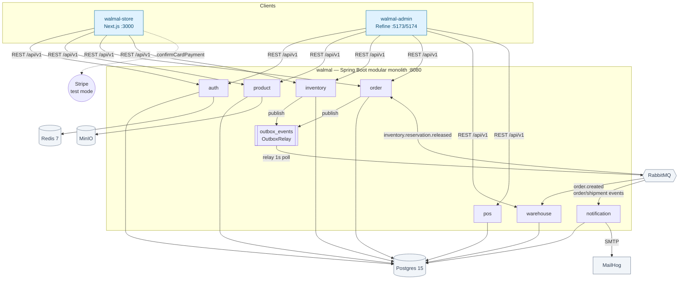

# walmal

Modular-monolith e-commerce backend (Spring Boot 3.4.5, Java 21) powering a
customer storefront and an ops admin. Eleven Maven modules, transactional
outbox for reliable event delivery, JWT auth with rotating single-use
refresh tokens, and a real (not stubbed) Stripe checkout integration.

| Repo | Role | Link |
|------|------|------|
| walmal (this repo) | Spring Boot modular monolith — the API for both frontends | you are here |
| [walmal-store](https://github.com/YeHtutAung/walmal-store) | Next.js App Router customer storefront | github.com/YeHtutAung/walmal-store |
| [walmal-admin](https://github.com/YeHtutAung/walmal-admin) | Refine ops admin SPA | github.com/YeHtutAung/walmal-admin |

## Architecture



Modules communicate synchronously via service interfaces (never another
module's repository bean) and asynchronously via a transactional outbox in
front of RabbitMQ — never a direct cross-module method call for async work.

## Engineering highlights

- **Transactional outbox, not fire-and-forget publish.** Business logic
  writes to `outbox_events` (V15 migration) inside the same DB transaction
  as the state change. `OutboxRelay` polls every second with
  `FOR UPDATE SKIP LOCKED`, sends to RabbitMQ, and caps retries at 60
  attempts before parking a row as `FAILED` — recoverable with a one-line
  status reset. A broker-outage drill (rows go `PENDING`, attempts climb,
  recover on broker restart) was verified live, not just unit-tested.

- **Event-driven fulfillment across modules.** An order creation publishes
  through the outbox; `walmal-warehouse` consumes it and auto-creates a
  fulfillment record. An inventory release event flows the other direction
  and cancels the order. Both paths are idempotent consumers, per the
  outbox's at-least-once delivery guarantee.

- **Guest checkout with email notifications.** V14 migration made
  `notification_log.recipient_id` and `warehouse_fulfillments.user_id`
  nullable so unauthenticated buyers get order/shipment emails without an
  account. Verified end-to-end through MailHog and `notification_log` rows.

- **JWT auth with rotating, single-use refresh tokens.** Access tokens are
  short-lived HS256 JWTs (15 min TTL); refresh tokens are single-use and
  rotated server-side in Redis. The storefront never stores the refresh
  token in JS-reachable storage — it lives only in an httpOnly, secure,
  `SameSite=strict` cookie set by the Next.js proxy routes.

- **Per-route rate limiting at the API edge.** `RateLimitFilter` in
  `walmal-app` enforces per-client request limits before requests reach
  business logic; the storefront's own API proxy routes add a second,
  independent layer of per-route limits (login, register, refresh,
  payment-intent).

- **Audited against a 45-item frontend security checklist.** The storefront
  passes all 45 items — token storage, security headers, RBAC, Stripe
  handling — tracked in `walmal-store/tests/security/FRONTEND_CHECKLIST.md`
  (45/45 PASS as of 2026-07-10), backed by a ZAP scan with zero critical or
  high automated alerts.

- **Stripe test-mode payments, not a mocked gateway.** Checkout uses
  Stripe's CardElement and `confirmCardPayment` against real `sk_test_`
  keys — exercised by the Playwright suite with real Stripe test cards,
  including a declined-card path.

- **Module boundaries enforced by dependency direction, not convention.**
  Cross-module reads (e.g. inventory's stock-health rollup calling
  product's catalogue service) follow the one-directional Maven dependency
  graph; a design that would create a reactor cycle was caught and flipped
  during review rather than shipped. See `docs/adr/`.

- **Both frontends tested end-to-end against the real backend.** No mocked
  API layer: Playwright runs against real Postgres, RabbitMQ, and Stripe test
  keys — 96 tests in the storefront (32 unique tests across chromium,
  firefox, and webkit) plus 21 in the admin, all passing.

- **Load-tested, not just functionally tested.** Six k6 scenarios (auth,
  product, checkout, inventory, POS, warehouse) run against the real
  backend with documented p95 latency and error-rate thresholds, all
  currently passing.

## Modules

| Module | Responsibility |
|--------|-----------------|
| `walmal-auth` | User accounts, JWT issuance/validation, roles, refresh-token lifecycle |
| `walmal-product` | Product catalogue, categories, variants, images |
| `walmal-inventory` | Stock levels, reservations, locations, outbox-driven reservation events |
| `walmal-order` | Order lifecycle (PENDING → CONFIRMED → FULFILLED / CANCELLED); guest order support |
| `walmal-pos` | Point-of-sale sales, offline-sync conflict resolution |
| `walmal-warehouse` | Fulfillments, picking/packing/shipping workflow |
| `walmal-notification` | Email notifications, guest-recipient support |
| `walmal-content` | Editable home-page CMS document (hero, tiles, promo) with a draft → publish lifecycle |

`walmal-common` (shared interfaces, no Spring beans), `walmal-infrastructure`
(RabbitMQ/MinIO/Redis/SMTP implementations, the outbox relay), and
`walmal-app` (API gateway, rate limiting, exception handling, the runnable
JAR) provide cross-cutting plumbing rather than owning business domains.

## Quickstart

```bash
# 1. Start infra: Postgres 15, Redis 7, RabbitMQ 3-management, MinIO, MailHog
docker compose up -d --wait

# 2. Build the runnable JAR
./mvnw -pl walmal-app -am -DskipTests clean package

# 3. Run with the test profile (lifted rate limits, extra CORS origins, V12 seed accounts)
java -Dspring.profiles.active=test -jar walmal-app/target/walmal-app-0.1.0-SNAPSHOT.jar

# 4. Verify
curl http://localhost:8080/actuator/health
# {"status":"UP"}
```

Swagger UI: `http://localhost:8080/swagger-ui.html`.

Test-only seed accounts (V12 migration — do not use these patterns in
production):

| Username | Password | Role |
|----------|----------|------|
| `customer_test` | `TestPass123!` | CUSTOMER |
| `admin_test` | `AdminPass123!` | ADMIN |

```bash
curl -X POST http://localhost:8080/api/v1/auth/login \
  -H "Content-Type: application/json" \
  -d '{"username":"customer_test","password":"TestPass123!"}'
# 200, bare DTO: {"accessToken":"...","refreshToken":"...","tokenType":"Bearer","expiresIn":900,"role":"CUSTOMER"}
```

## Testing

- **Unit tests** (no containers, Mockito): `./mvnw test`
- **Integration tests** (`@Tag("integration")`, Testcontainers — Postgres/Redis/RabbitMQ per test class, excluded by default): `./mvnw test -DexcludedGroups=`
- **walmal-store E2E** (Playwright, real backend + Stripe test mode): 96 tests pass — 32 unique tests across chromium, firefox, and webkit.
- **walmal-admin E2E** (Playwright, Chromium, real backend): 21 tests pass, plus 65 Vitest unit tests across 13 files.
- **k6 load tests** (`tests/performance/`): 6 scenarios — auth, product, checkout, inventory, POS, warehouse — all thresholds currently met.

## Documentation

- `docs/adr/` — architecture decision records: [ADR-2 Authentication Module](docs/adr/ADR-2-auth-module.md), [ADR-3 Product Module](docs/adr/ADR-3-product-module.md), [ADR-4 Inventory Module](docs/adr/ADR-4-inventory-module.md), [ADR-5 Order Module](docs/adr/ADR-5-order-module-architecture.md), [ADR-6 POS Module](docs/adr/ADR-6-pos-module-architecture.md), [ADR-9 API Gateway Layer](docs/adr/ADR-9-api-gateway-layer.md), [ADR-10 Content Module](docs/adr/ADR-10-content-module.md)
- `docs/kb/` — agent-facing knowledge base (also the canonical source for every number in this README)
- [Engineering onboarding (Notion)](https://app.notion.com/p/39ebded4025781119a34e141510fe72a) — start here if you're new: machine setup, an architecture reading order, and an annotated first PR. Links back to `docs/kb/` for every fact rather than restating them, so it can't drift.
