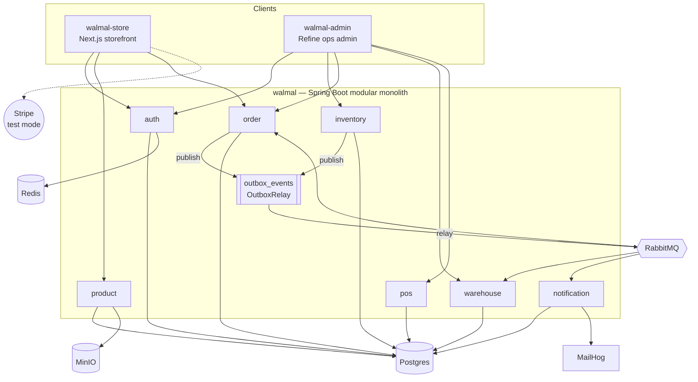

# Notion Engineering-Onboarding KB — Implementation Plan

> **For agentic workers:** REQUIRED SUB-SKILL: Use superpowers:subagent-driven-development (recommended) or superpowers:executing-plans to implement this plan task-by-task. Steps use checkbox (`- [ ]`) syntax for tracking.

**Goal:** Build a six-page Notion tree that takes a new engineer from a clean machine to their first PR across the three walmal repos, asserting no fact that a commit could falsify.

**Architecture:** Notion is a **front door, not a mirror**. It holds only the onboarding narrative that no repo has today (orientation, setup, reading order, first-PR walkthrough) and deep-links to canonical files on GitHub for every fact. See the spec: `docs/superpowers/specs/2026-07-15-notion-onboarding-kb-design.md`.

**Tech Stack:** Notion MCP tools (`notion-create-pages`, `notion-update-page`, `notion-fetch`), `curl` for link verification, git for the single README change.

---

## Why this plan has no unit tests

There is no test framework for Notion pages, so the usual TDD loop does not
apply. Two things here **are** mechanically verifiable, and they carry the
verification weight instead:

1. **Link integrity** — every GitHub deep link must return HTTP 200. A 404 is
   this design's one real failure mode: the whole tree is links, and a broken
   link is a broken page. Verified with `curl` in Task 1 and again in Task 9.
2. **The no-facts rule** — page content must not assert falsifiable values.
   Verified by a grep for banned patterns (Task 9), plus review.

Task 1 front-loads link verification deliberately: **every later task depends
on the link table, so it is proven before any page is written.** That is the
closest honest analogue to "write the failing test first" — it fails loudly,
before the work built on it.

## The rule that governs every page

> **Notion pages contain no facts.** No ports, no TTLs, no counts, no endpoint
> shapes, no env var names. Anything falsifiable by a commit lives in the repo
> and is linked, never copied.

**Exception (from the spec):** stable-interface *commands* (`docker compose up
-d --wait`, `mvnw` invocations), the entry-point URL (`/actuator/health`), and
the JDK major version (21) may appear. **Values never do.**

Before writing any sentence, apply the test: **could a commit make this
false?** If yes, it becomes a link.

## File structure

Almost nothing here is a file. The whole deliverable is Notion pages.

| Artifact | Kind | Responsibility |
|---|---|---|
| `walmal — Engineering Onboarding` | Notion parent | Entry point; states the no-facts rule; holds the six children |
| `1. Orientation` | Notion child | What the system is, three-repo split, de-labelled topology diagram |
| `2. Set Up Your Machine` | Notion child | Clean machine → running stack; portable sharp edges |
| `3. Architecture` | Notion child | Reading order + the two "we already made this mistake" stories |
| `4. Rules You Must Not Break` | Notion child | What gets a PR rejected, and why |
| `5. Your First PR` | Notion child | Annotated daily-summary trace |
| `6. Where the Docs Live` | Notion child | Canonical-source map |
| `walmal/README.md` | Modify (~line 199) | One-line pointer to the Notion parent, in the Documentation section |

**Branch:** `docs/notion-onboarding-kb` (already checked out; spec committed).

---

## Task 1: Verify the link table before building anything on it

Every page is links. Prove they resolve **before** writing prose around them.

**Files:**
- Create: none (scratch file only)

- [ ] **Step 1: Read the Notion markdown spec**

The `notion-create-pages` tool requires Notion-flavored Markdown. Read the MCP
resource `notion://docs/enhanced-markdown-spec` **through the MCP client's
resource-reading interface**. Do NOT pass that URI to `notion-fetch` or any
URL-fetching tool. Do not guess the syntax.

- [ ] **Step 2: Write the link table to a scratch file**

Note the branch difference: `walmal` and `walmal-store` are `main`;
**`walmal-admin` is `master`**. A `main` link to walmal-admin 404s.

Write to `<scratchpad>/links.txt` (the session scratchpad directory named in
the environment), one URL per line:

```
https://github.com/YeHtutAung/walmal
https://github.com/YeHtutAung/walmal-store
https://github.com/YeHtutAung/walmal-admin
https://github.com/YeHtutAung/walmal/blob/main/README.md
https://github.com/YeHtutAung/walmal/blob/main/CLAUDE.md
https://github.com/YeHtutAung/walmal/blob/main/docs/kb/SYSTEM.md
https://github.com/YeHtutAung/walmal/blob/main/docs/kb/architecture.md
https://github.com/YeHtutAung/walmal/blob/main/docs/kb/conventions.md
https://github.com/YeHtutAung/walmal/blob/main/docs/kb/gotchas.md
https://github.com/YeHtutAung/walmal/blob/main/docs/kb/testing.md
https://github.com/YeHtutAung/walmal/blob/main/docs/adr/ADR-2-auth-module.md
https://github.com/YeHtutAung/walmal/blob/main/docs/adr/ADR-3-product-module.md
https://github.com/YeHtutAung/walmal/blob/main/docs/adr/ADR-4-inventory-module.md
https://github.com/YeHtutAung/walmal/blob/main/docs/adr/ADR-5-order-module-architecture.md
https://github.com/YeHtutAung/walmal/blob/main/docs/adr/ADR-6-pos-module-architecture.md
https://github.com/YeHtutAung/walmal/blob/main/docs/adr/ADR-9-api-gateway-layer.md
https://github.com/YeHtutAung/walmal/blob/main/docs/DEPLOYMENT.md
https://github.com/YeHtutAung/walmal/blob/main/docs/DR_PLAN.md
https://github.com/YeHtutAung/walmal/blob/main/walmal-order/src/main/java/com/walmal/order/api/OrderController.java
https://github.com/YeHtutAung/walmal/tree/main/walmal-app/src/main/resources/db/migration
https://github.com/YeHtutAung/walmal-store/blob/main/README.md
https://github.com/YeHtutAung/walmal-store/blob/main/docs/kb/architecture.md
https://github.com/YeHtutAung/walmal-store/blob/main/docs/kb/conventions.md
https://github.com/YeHtutAung/walmal-store/blob/main/docs/kb/gotchas.md
https://github.com/YeHtutAung/walmal-store/blob/main/docs/kb/testing.md
https://github.com/YeHtutAung/walmal-admin/blob/master/README.md
https://github.com/YeHtutAung/walmal-admin/blob/master/CLAUDE.md
https://github.com/YeHtutAung/walmal-admin/blob/master/docs/kb/architecture.md
https://github.com/YeHtutAung/walmal-admin/blob/master/docs/kb/conventions.md
https://github.com/YeHtutAung/walmal-admin/blob/master/docs/kb/gotchas.md
https://github.com/YeHtutAung/walmal-admin/blob/master/docs/kb/testing.md
```

- [ ] **Step 3: Run the link check — expect failures to be visible**

```bash
SCRATCH="C:/Users/yehtu/AppData/Local/Temp/claude/C--YHA-006-Claude-Workspace-walmal/d0812832-d92d-4e10-aef2-f000b681449c/scratchpad"
while read -r u; do
  code=$(curl -s -o /dev/null -w "%{http_code}" -L "$u")
  [ "$code" = "200" ] && echo "OK   $code $u" || echo "FAIL $code $u"
done < "$SCRATCH/links.txt"
```

Expected: **every line `OK   200`**, zero `FAIL` lines.

Print every line rather than a count — the failing URL is the only thing worth
knowing here, and a count cannot tell you which one broke.

**Use `/tree/` not `/blob/` for directory links.** GitHub 301-redirects
`/blob/` on a directory; it passes only because `-L` follows the redirect.
Verified 2026-07-15: all 31 URLs return a direct 200, no redirect needed —
so a `FAIL` here is a genuine break, never a redirect artifact.

If any FAIL: the file moved or the branch is wrong. Fix the URL, or drop the
link and adjust the page that would have used it. **Do not write a page around
a URL that 404s.**

Note: unpushed local commits mean a file exists locally but 404s on GitHub.
Check `git status` / `git log origin/main..HEAD` if a link fails unexpectedly.

- [ ] **Step 4: Confirm all three repos are public**

```bash
for r in walmal walmal-admin walmal-store; do
  gh repo view YeHtutAung/$r --json visibility -q .visibility
done
```

Expected: `PUBLIC` three times. If any is private, **stop** — deep links
require a GitHub login the reader may not have, which invalidates the
front-door approach. Surface to the human.

---

## Task 2: Create the parent page

**Files:** none (Notion only)

- [ ] **Step 1: Create the parent page**

Use `notion-create-pages` with **no parent** (creates a workspace-level
private page — the workspace is `Ye Htut Aung's Space`, currently empty).

- Title: `walmal — Engineering Onboarding`
- Icon: `🧭`

Content: a one-paragraph statement of who the page is for (a new engineer
going from clean machine to first PR), the reading order (pages 1→6), and
then the no-facts rule stated verbatim as a callout:

> **This tree contains no facts.** Ports, contracts, counts, and env vars live
> in the repos and are linked, never copied — so nothing here can go stale.
> When you need an exact value, follow the link. The repo is always right.

- [ ] **Step 2: Capture the parent page ID**

Record the returned page ID/URL. **Every subsequent task uses it as
`parent: {type: "page_id", page_id: "<ID>"}`.**

- [ ] **Step 3: Verify it rendered**

`notion-fetch` the ID. Expected: title and the no-facts callout present.

---

## Task 3: Page 1 — Orientation

**Files:** none (Notion only)

- [ ] **Step 1: Build the de-labelled diagram**

Take the Mermaid graph from `walmal/README.md` (starts ~line 16) and **strip
every value label**: `:3000`, `:5173/5174`, `:8080`, `relay 1s poll`,
`order.created`, `reservation.released`, `REST /api/v1`, `confirmCardPayment`.
Keep the topology and the node identities.

The spec authorizes this divergence: the README may state values because it is
updated in-commit; Notion may not.



- [ ] **Step 2: Create the page**

`notion-create-pages`, parent = Task 2's ID. Title `1. Orientation`, icon `🗺️`.

Content:
- One paragraph: walmal is an omnichannel retail platform — a Spring Boot
  modular monolith serving two frontends. Modular monolith means module
  boundaries are enforced *inside* one deployable, not across services.
- The three-repo table: repo → role → link. **Role and link only — no ports.**
  (`walmal` = backend/hub and the API for both frontends; `walmal-store` =
  customer storefront; `walmal-admin` = ops admin for staff.)
- The diagram from Step 1, introduced as "topology, not configuration —
  for ports and routing keys see SYSTEM.md" with the link.
- A line beneath it linking to the README's fuller labelled diagram.
- "Where to go next → 2. Set Up Your Machine."

- [ ] **Step 3: Verify**

`notion-fetch` the page. Expected: Mermaid block renders as a diagram (not a
raw code block); no port numbers anywhere in the content.

---

## Task 4: Page 2 — Set Up Your Machine

The page with the highest failure cost: if it is wrong, the reader is stuck
before they start. Success criterion: **a newcomer reaches a running stack
without asking the author anything.**

**Files:** none (Notion only)

- [ ] **Step 1: Create the page**

Parent = Task 2's ID. Title `2. Set Up Your Machine`, icon `⚙️`.

Content — prerequisites (JDK 21 and Docker are the sanctioned exception; do
not list versions of anything else), then the ordered path:

```bash
# 1. Start infra (Postgres, Redis, RabbitMQ, MinIO, MailHog)
docker compose up -d --wait

# 2. Build the runnable JAR
./mvnw -pl walmal-app -am -DskipTests clean package

# 3. Run with the test profile
java -Dspring.profiles.active=test -jar walmal-app/target/*.jar

# 4. Verify
curl http://localhost:8080/actuator/health
```

State that the test profile is what you want locally (lifted rate limits,
extra CORS origins, seed accounts) and **link to SYSTEM.md rather than listing
what it changes**. Link to the walmal README quickstart as canonical.

For the two frontends: one line each — install deps, set the env var, run dev
— **linking to each repo's README for the variable names and values.** Note
that both require the backend running first and neither has a mock API layer.

- [ ] **Step 2: Add the "Known sharp edges" section**

The three **portable** traps (all three bite everyone; each produces a
symptom that does not point at its cause):

1. **Stale JAR.** Symptom: config changes appear to do nothing after restart.
   Cause: the running JAR packaged the config at build time; working-tree
   edits are invisible to it. Fix: rebuild the JAR. Link `docs/kb/testing.md`
   (Stale JAR Rule).
2. **`-pl` without `-am`.** Symptom: phantom "symbol not found" or
   `NoClassDefFoundError` in otherwise-green tests. Cause: compiles against a
   stale `walmal-common` in `~/.m2` instead of source. Fix: always add `-am`.
   Link `docs/kb/gotchas.md`.
3. **Testcontainers + current Docker Engine.** Symptom: integration tests fail
   on API negotiation. Cause: recent Docker Engine versions break
   Testcontainers' version negotiation. Fix: pass the workaround flag —
   **link `docs/kb/testing.md` (Testcontainers Workaround) for the flag; do
   not reproduce it**, it is a version value.

   Note the title deliberately omits the Docker version: naming it would be a
   falsifiable fact, and Task 9's audit bans it. The KB owns the versions.

Add a closing line: the machine-specific notes in `gotchas.md` (WSL layout,
Cygwin shell caveats, k6 install) describe **the author's Windows box, not the
project** — read them only if your symptoms match. Link `gotchas.md`.

- [ ] **Step 3: Verify**

`notion-fetch`. Expected: no version numbers except JDK 21; no ports except
the `/actuator/health` entry-point URL; all three sharp edges present with
links.

---

## Task 5: Page 3 — Architecture

**Files:** none (Notion only)

- [ ] **Step 1: Create the page with the reading order**

Parent = Task 2's ID. Title `3. Architecture`, icon `🏗️`.

An ordered list, each stop = one sentence of *why you care* + a link. **No
facts — the "why" is durable, the contents are not.**

1. **The module map** → `docs/kb/architecture.md`. Why: tells you which module
   owns what, which is the first question every change asks.
2. **The boundary rules** → `CLAUDE.md`. Why: these are enforced, not
   aspirational — violating one is how a PR gets rejected.
3. **The outbox** → `docs/kb/architecture.md` + `SYSTEM.md` (Event Contract).
   Why: async work goes through a transactional outbox, never a direct call.
   Understand this before touching anything that publishes an event.
4. **Cross-repo contracts** → `SYSTEM.md`. Why: if your change touches auth,
   error bodies, events, ports, or env vars, this file is canonical and must
   be updated in the same session.
5. **The ADRs** → `docs/adr/`. Why: they record *why* decisions were made.
   Read the one for the module you are touching before proposing to change it.

- [ ] **Step 2: Add the two "we already made this mistake" sections**

These are the highest-value onboarding content in the project: real mistakes,
already caught, that a newcomer would otherwise repeat. Tell each as a story;
**link for the detail.**

**The dependency cycle that does not build.** The category stock-health
endpoint was originally specced under `walmal-product` and had to be flipped
to `walmal-inventory` during design. `walmal-inventory` already depends on
`walmal-product`; the reverse edge would create a Maven reactor cycle and fail
to build. The lesson generalizes: **check the dependency direction before
choosing a module.** Warn explicitly: do not "fix" this by moving the endpoint
back — that is the direction that does not build. Link `architecture.md`
(Admin Aggregation Endpoints).

**The LIKE-escaping trap that nearly shipped twice.** Hand-written JPQL escapes
user input manually *and* declares `ESCAPE`; derived `Containing` queries
escape themselves. Do exactly one, never both — double-escaping silently
breaks matching for input containing wildcards. It is silent, which is why it
nearly shipped twice. Link `architecture.md` (Search Endpoints).

- [ ] **Step 3: Add the frontend pointer**

Two lines: the store and admin have their own `docs/kb/architecture.md`;
read the one for the repo you are working in. Link both (**admin =
`master`**).

- [ ] **Step 4: Verify**

`notion-fetch`. Expected: five reading-order stops with links; both stories
present; no response shapes or endpoint contracts reproduced.

---

## Task 6: Page 4 — Rules You Must Not Break

**Files:** none (Notion only)

- [ ] **Step 1: Create the page**

Parent = Task 2's ID. Title `4. Rules You Must Not Break`, icon `🚧`.

Framing line: this is what gets a PR rejected. Each rule = the rule, a one-line
*why*, and a link to `CLAUDE.md` as canonical. **Do not reproduce CLAUDE.md's
tables** — link them.

1. **Never inject another module's repository.** Cross-module calls go through
   service interfaces in `application/`. Why: the interface is the contract;
   the repository is an implementation detail, and depending on it welds two
   modules together permanently.
2. **Never use `RabbitTemplate`, `RedisTemplate`, or the MinIO SDK in business
   logic.** Go through the `walmal-common` interfaces. Why: infrastructure
   swaps should change one implementation, not every caller.
3. **Async work goes through the outbox, never a direct cross-module call.**
   Why: a direct call is not transactional with your state change — it fires
   even if the transaction rolls back.
4. **Write the audit log before destructive DB operations**, not after. Why:
   after is too late to record something that just failed.
5. **Update the KB in the same commit as any documented-fact change.** Why:
   the KB is canonical; a KB that lags the code is worse than none. Note the
   cross-repo nuance: if a contract changed, `SYSTEM.md` updates in the same
   *session* — cross-repo commit atomicity is not required.

- [ ] **Step 2: Add the review-check line**

Every review must answer: "Does this change require a KB update, and was it
made?" Refactors and test-only changes that alter no documented fact need
none. Link `CLAUDE.md`.

- [ ] **Step 3: Verify**

`notion-fetch`. Expected: five rules, each with a why and a link; no copied
tables.

---

## Task 7: Page 5 — Your First PR

**Files:** none (Notion only)

- [ ] **Step 1: Create the page with the trace**

Parent = Task 2's ID. Title `5. Your First PR`, icon `🚀`.

Trace `GET /api/v1/orders/admin/daily-summary` — chosen because the KB already
documents its reasoning in unusual depth, so the walkthrough links rather than
explains. Each stop names the type and says what it is *for*:

1. `OrderController` (`walmal-order`, `api/`) — REST surface and the role
   gate. Controllers hold no business logic.
2. `OrderAdminService` (`application/`) — the **interface**. This is what
   other modules may depend on; nothing below this line is public.
3. `OrderAdminServiceImpl` — `getDailySummary()` computes the query bounds and
   delegates to the **pure** `buildDailySummary(...)`, which does the
   bucketing, zero-fill, and summing.
4. `OrderRepository.findForDailySummary` — a JPQL **constructor projection**
   returning lightweight rows, not full entities.
5. `OrderTimeseriesRow` / `DailyOrderSummaryDto` — the projection row and the
   response DTO.

Link `OrderController.java` on GitHub and `architecture.md` (Admin Aggregation
Endpoints) for the reasoning.

**The endpoint path is named here deliberately**, even though Task 3 strips
`REST /api/v1` from the diagram as a value label. The path is this page's
*subject* — a trace has to say what it traces, and there is nothing to link
"it" to. The audit does not ban it. Do not re-litigate this in Task 9.

- [ ] **Step 2: Explain why the pure method is split out**

This is the transferable lesson, not trivia: the aggregation lives in a
separate pure method **because that makes it unit-testable without a
database**. The tests demonstrate the payoff —
`OrderAdminServiceDailySummaryTest` (pure unit, no DB),
`OrderDailySummaryIntegrationTest` (the DB path), `OrderControllerTest` (the
web layer). State the precedent: future rollup endpoints should follow this
shape — project a flat row in the repository, keep grouping/summing in a pure
method, call it from a thin service method.

- [ ] **Step 3: Add the "no migration here" note**

This endpoint is a read-only aggregation over tables created by an earlier
migration — it added none of its own. Many PRs do add one; this trace does
not. Link the Flyway map in `architecture.md` and the migration naming
convention in `CLAUDE.md` rather than inventing a step this trace does not
have.

**Do not name the migration version.** Versions get squashed and renumbered —
that is a falsifiable fact, and Task 9's audit bans it. The Flyway map owns it;
link there.

- [ ] **Step 4: Add the KB-update step**

Close the loop: a change to this endpoint updates `docs/kb/architecture.md`
(which documents it) and `docs/kb/SYSTEM.md` (which carries its response
contract, since it is admin-facing) **in the same commit**. This is the step
newcomers forget and reviewers reject. Link both.

- [ ] **Step 5: Verify**

`notion-fetch`. Expected: five trace stops; the three test class names; the
no-migration note; the KB-update step. **No response-shape details copied.**

---

## Task 8: Page 6 — Where the Docs Live

**Files:** none (Notion only)

- [ ] **Step 1: Create the page**

Parent = Task 2's ID. Title `6. Where the Docs Live`, icon `📚`.

Answers "I have a question — where do I look?" A table: source → what it is
canonical for → link.

| Source | Canonical for |
|---|---|
| `walmal/docs/kb/SYSTEM.md` | Cross-repo contracts: auth, error bodies, events, ports, env vars |
| each repo's `docs/kb/architecture.md` | That repo's internal structure |
| each repo's `docs/kb/conventions.md` | That repo's coding conventions |
| each repo's `docs/kb/gotchas.md` | Known pitfalls (some machine-specific) |
| each repo's `docs/kb/testing.md` | How to run that repo's tests |
| `walmal/CLAUDE.md` | Architecture rules, naming, Definition of Done |
| `walmal/docs/adr/` | *Why* decisions were made |
| `README.md` (each repo) | Human-facing overview |

- [ ] **Step 2: State the precedence rules**

Two rules that resolve every conflict:
- **The KB wins over the README.** READMEs mirror KB numbers; the KB copy is
  canonical.
- **`SYSTEM.md` wins for anything cross-repo.** If a per-repo doc and
  `SYSTEM.md` disagree about a contract, `SYSTEM.md` is right.

Add: `walmal/docs/kb/conventions.md` is a good model of the pattern this whole
tree follows — it links to `CLAUDE.md` rather than duplicating the rules.

- [ ] **Step 3: Verify**

`notion-fetch`. Expected: the table with working links; both precedence rules.

---

## Task 9: Full-tree verification

Do not skip. This is where the plan's two verifiable claims get checked
against what actually shipped, rather than what was intended.

**Files:** none

- [ ] **Step 1: Re-run the link check against live page content**

`notion-fetch` all seven pages, write their full content to
`<scratchpad>/pages.txt`, then extract and re-check every GitHub URL actually
present — not the Task 1 table. Links typed into pages but never in that table
are the likeliest source of a 404.

```bash
SCRATCH="C:/Users/yehtu/AppData/Local/Temp/claude/C--YHA-006-Claude-Workspace-walmal/d0812832-d92d-4e10-aef2-f000b681449c/scratchpad"
# Extract EVERY http(s) URL — not just github.com. See the auto-linkify note below.
grep -oE 'https?://[^ )"]+' "$SCRATCH/pages.txt" | sed 's/[.,]$//' | sort -u > "$SCRATCH/live-links.txt"
while read -r u; do
  code=$(curl -s -o /dev/null -w "%{http_code}" "$u")
  [ "$code" = "200" ] && echo "OK   $code $u" || echo "FAIL $code $u"
done < "$SCRATCH/live-links.txt"
```

Expected: every line `OK   200`, zero `FAIL`.

**Extract every URL, not only `github.com` ones.** Notion **auto-linkifies bare
filenames**: a plain-text `gotchas.md` in a heading silently became
`[gotchas.md](http://gotchas.md)` — a fabricated, broken link the author never
wrote. A github-only grep does not catch it. Confirmed live on page 2, found
and fixed 2026-07-15.

Any non-`github.com`, non-`app.notion.com` URL in the output is almost
certainly an auto-linkify artifact: fix it by rewording so no bare `*.md`
filename appears in a heading or as standalone text.

- [ ] **Step 2: Audit for the no-facts rule**

Search the fetched content for banned patterns:

```
# ports
:3000  :3001  :5173  :5174  :8080  :5432  :6379  :5672  :15672  :9000  :9001
:1025  :8025
# versions (incl. the labels Task 3 strips and the flag Task 4 links)
"Postgres 15"  "Redis 7"  "Docker 29"  "29.x"  "1.20.4"  "1.44"  api.version
# TTLs / counts / tallies
"15 min"  "60 attempts"  "45/45"  "96 tests"  "21 tests"  "65 "  "247 "
"1s poll"  "30 entries"
# migration versions
V1  V5  V9  V12  V14  V15
# routing keys / event names / SDK calls
"order.created"  "reservation.released"  "inventory.stock.low"
confirmCardPayment  SMTP
# env vars
WALMAL_  VITE_  NEXT_PUBLIC_  SPRING_  MINIO_  STRIPE_
```

Expected: **zero hits**, with these sanctioned exceptions only —
`localhost:8080/actuator/health` on page 2, and `21` where it means JDK 21.

Any other hit is a rule violation: replace the value with a link to the file
that owns it.

Two notes on running this:
- The banned list mirrors what Task 3 strips and what Task 4 refuses to
  reproduce. If those tasks were done right, this finds nothing — that is the
  point; it is a check, not a cleanup pass.
- Judgment still applies on near-misses. `"minutes"` was deliberately left out
  of the list because it false-positives on ordinary prose ("takes a few
  minutes"); a TTL stated in minutes is still a violation. The list is a net,
  not the rule — the rule is *could a commit make this false?*

- [ ] **Step 3: Check the reading path holds together**

Read pages 1→6 in order as a newcomer would. Confirm each ends by pointing at
the next, no page assumes something only a later page explains, and page 2
alone is sufficient to reach a running stack (success criterion 1).

- [ ] **Step 4: Report the parent URL**

Surface the parent page URL to the human — it is needed for Task 10.

---

## Task 10: Add the repo pointer and commit

The only git change in the entire plan.

**Files:**
- Modify: `README.md` (Documentation section, ~line 199-203)

- [ ] **Step 1: Add the pointer line**

Append to the `## Documentation` bullet list, using the real parent URL from
Task 9:

```markdown
- [Engineering onboarding (Notion)](<PARENT_URL>) — start here if you're new: setup, architecture reading order, and an annotated first PR
```

The README, not `docs/kb/`, because the Notion tree is human-facing onboarding
and the README is where a human looks first; `docs/kb/` is agent-facing.

- [ ] **Step 2: Verify the KB-update question**

Per `CLAUDE.md`, every change answers: "Does this change require a KB update?"
**Answer: no.** This adds a pointer, not a documented fact — no endpoint,
contract, config, or workflow changed. Record that reasoning in the commit
body; do not skip the question silently.

- [ ] **Step 3: Commit**

```bash
cd C:/YHA/006_Claude_Workspace/walmal
git add README.md
git commit -m "$(cat <<'EOF'
docs(readme): link the Notion engineering-onboarding tree

The Notion tree holds the onboarding narrative no repo has today
(setup, reading order, annotated first PR) and links to docs/kb for
every fact, so it cannot drift.

No KB update required: this adds a pointer, not a documented fact.

Co-Authored-By: Claude Opus 4.8 <noreply@anthropic.com>
EOF
)"
```

- [ ] **Step 4: Confirm the commit landed**

```bash
git log --oneline -2 && git status --short
```

Expected: the commit at HEAD on `docs/notion-onboarding-kb`, clean tree.

- [ ] **Step 5: Stop — do not push or open a PR**

Pushing publishes to a public repo. Report the branch state and let the human
decide. Two commits should be on the branch: the spec and this pointer.

---

## Done when

- [ ] Seven Notion pages exist (parent + six children) in the stated order.
- [ ] Every GitHub link in every page returns 200 (Task 9 Step 1).
- [ ] The no-facts audit is clean, exceptions aside (Task 9 Step 2).
- [ ] Page 2 alone gets a newcomer to a running stack.
- [ ] `README.md` points at the parent; committed, not pushed.
